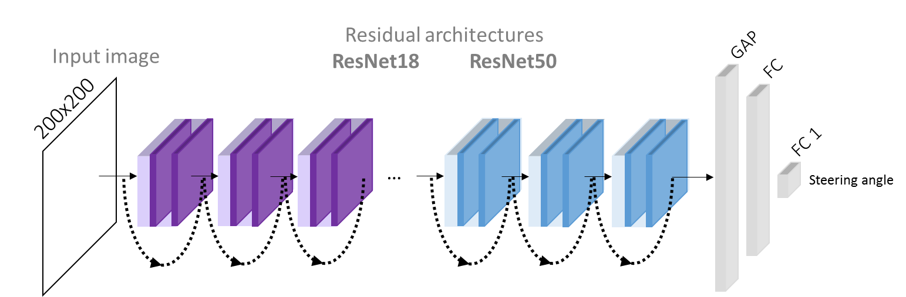

# Event-based Vision meets Deep Learning on Steering Prediction for Self-driving Cars

This repository contains a deep learning approach to unlock the potential of event cameras on the prediction of a vehicles's steering angle.

#### Citing

If you use this code in an academic context, please cite the following publication:

Paper: [Event-based vision meets deep learning on steering prediction for self-driving cars](http://rpg.ifi.uzh.ch/docs/CVPR18_Maqueda.pdf)

Video: [YouTube](https://www.youtube.com/watch?v=_r_bsjkJTHA&feature=youtu.be)

```
@inproceedings{maqueda_2018,
  title={Event-based vision meets deep learning on steering prediction for self-driving cars},
  author={Maqueda, Ana I and Loquercio, Antonio and Gallego, Guillermo and Garc{\i}a, Narciso and Scaramuzza, Davide},
  booktitle={Proceedings of the IEEE Conference on Computer Vision and Pattern Recognition},
  pages={5419--5427},
  year={2018}
}

```

## Introduction

Steering angle prediction with standard cameras is not robust to scenes characterized by high dynamic range (HDR), motion blur, and low light. Event cameras, however, are bioinspired sensors that are able to solve all three problems at once. They output a stream of asynchronous events that are generated by moving edges in the scene. Their natural response to motion, and their advantages over traditional cameras (very high temporal resolution, very high dynamic range, and low latency) make them a perfect fit for the steering prediction task, which is addressed by a DL-based solution from a regression viewpoint.


### Model

A series of ResNet architectures, i.e., ResNet18 and ResNet50, have been deployed to carry out the steering prediction task. They are used as feature extractors, considering only their convolutional layers. Next, a global average pooling (GAP) layer is used to encode the image features into a vectorized descriptor that feeds a fully-connected (FC) layer (256-dimensional for ResNet18 and 1024-dimensional for ResNet50). This FC layer is followed by a ReLU non-linearity, and the final 1-dimensional FC layer to output the predicted steering angle. The weights of a ResNet-50 trained on the entire dataser are available at [this link](https://github.com/uzh-rpg/event_steering_angle_public/releases/tag/ResNet50Full).




### Data

In order to learn steering angles from event images, the publicly available [DAVIS Driving Dataset 2017 (DDD17)](https://docs.google.com/document/d/1HM0CSmjO8nOpUeTvmPjopcBcVCk7KXvLUuiZFS6TWSg/pub) has been used. It provides approximately 12 hours of annotated driving recordings collected by a car under different road, weather, and illumination conditions. The dataset includes asynchronous events as well as synchronous grayscale frames.


## Running the code

### Software requirements

This code has been tested on Ubuntu 14.04, and on Python 3.4.

Dependencies:
- Tensorflow
- Keras 2.1.4
- NumPy 
- OpenCV
- scikit-learn
- Python gflags


### Data preparation

Please follow the instructions from the [DDD17 site](https://docs.google.com/document/d/1HM0CSmjO8nOpUeTvmPjopcBcVCk7KXvLUuiZFS6TWSg/pub), to download the dataset and visualize the HDF5 file contents. After that, you should get the following structure:

```
DDD17/
	run1_test/
	run2/
	run3/
	run4/
	run5/
```

Authors also provide some [code](https://code.ini.uzh.ch/jbinas/ddd17-utils) for viewing and exporting the data. Download the repository and copy the files within the ```data_preprocessing``` directory.

Asynchronous events are converted into synchronous event frames by pixel-wise accumulation over a constant time interval, using separate channels for positive and negative events. To prepare the data in the format required by our implementation, follow these steps:


#### 1. Accumulate events

Run ```data_preprocessing/reduce_to_frame_based.py``` to reduce data to frame-based representation. The output is another HDF5 file, containing the frame-based data as a result of accumulating the events every other ```binsize``` seconds. The created HDF5 file will contain two new fields:
- **dvs_frame**: event frames (a 4-tensor, with number_of_frames x width x height x 2 elements).
- **aps_frame**: grayscales frames (a 3-tensor, with number_of_frames x width x height).

```
python data_preprocessing/reduce_to_frame_based.py --binsize 0.050 --update_prog_every 10 --keep_events 1 --source_folder ../DDD17 --dest_folder ../DDD17/DAVIS_50ms
```

Note: the ```reduce_to_frame_based.py``` script is the original ```export.py``` provided by the authors, which has been modified in order to compute several HDF5 files from a source directory, and save positive and negative event frames by separately.


#### 2. Split recordings

Run ```data_preprocessing/split_recordings.py``` to split the recordings into consecutive and non-overlapping short sequences of a few seconds each. Subsets of these sequences are used for training and testing, respectively. In particular, we set training sequences to 40 sec, and testing sequences to 20 sec.

```
python data_preprocessing/split_recordings.py --source_folder ./DDD17/DAVIS_50ms --rewrite 1 --train_per 40 --test_per 20
```

Note: the ```split_recordings.py``` is the original ```prepare_cnn_data.py``` provided by the authors, which has been modified in order to compute several HDF5 files from a source directory, and avoid frame pre-processing.


#### 3. Compute percentiles

Run ```data_preprocessing/compute_percentiles.py``` to compute some percentiles from DVS/event frames in order to remove outliers, and normalize them.

```
python data_preprocessing/compute_percentiles.py --source_folder ./DDD17/DAVIS_50ms --inf_pos_percentile 0.0 --sup_pos_percentile 0.9998 --inf_neg_percentile 0.0 --sup_neg_percentile 0.9998
```


#### 4. Export CNN data

Run ```data_preprocessing/export_cnn_data.py``` to export DVS/event frames, APS/grayscale frames, difference of grayscale frames (APS diff) in PNG format, and text files with steering angles form the HDF5 files to be used by the network.

```
python export_cnn_data.py --source_folder ./DDD17/DAVIS_50ms
```
